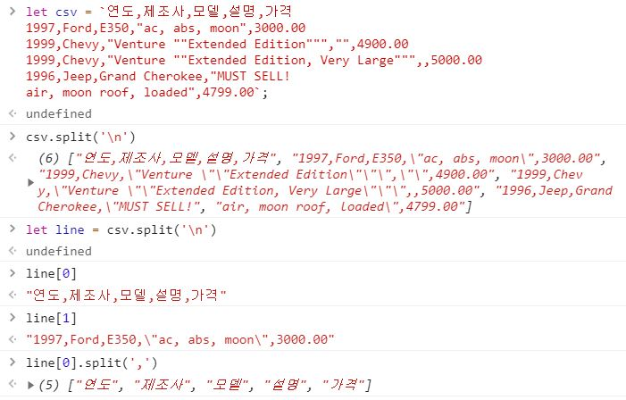

# 2021-07-21-TIL DAY 2

## 문자열 다루기

- str[index]

```jsx
var str = 'steven';
console.log(str[0]); // s
console.log(str[3]); // v
console.log(str[6]; // undefined

index에 접근은 가능하지만 수정할 수는 없다.(read-only)

str[0] = 'S';
console.log(str); // steven
```

- concatenating string

```jsx
// + 연산자를 사용할 수 있다.
// string 타입을 다른 타입 사이에 + 연산자를 쓰면 string 형식으로 변환된다.

var str1 = 'kim';
var str2 = 'jongseo';
var str3 = '2';

console.log(str1 + str2); // 'kimjongseo'
console.log(str3 + 8); // 28

// str1.concat(str2, str3...) 메소드로도 사용할 수 있다.
```

- length property

```jsx
var str = 'steven';
console.log(str.length); // 6

// 문자열의 전체 길이를 반환한다.
```

- str.indexOf()

```jsx
'Kim JongSeo'.indexOf('Kim'); // 0 : 처음으로 일치하는 인덱스 출력
'Kim JongSeo'.indexOf('kim'); // -1 : 찾고자 하는 인덱스가 없으면 -1 출력
'Kim JongSeo'.indexOf('Jong'); // 4
'Kim JongSeo JongSeo'.indexOf('Jong'); // 4 : 문자열 앞에서 부터 탐색, lastIndexOf는 문자열 뒤에서 부터 탐색
'Kim JongSeo JongSeo'.lastIndexOf('Jong') // 12

str.includes()는 해당 문자가 있는지 boolean값 출력
```

- str.split()

```jsx
var str = 'a b c d e'
console.log(str.split(' ')); // ['a', 'b', 'c', 'd', 'e']

// csv 형식을 처리할 때 유용하다.
```



- str.substring(start, end)

```jsx
var str = 'abcdefghij';
console.log(str.substring(0, 3)); // 'abc' : start 값은 포함되나 end 값은 포함되지 않는다.
console.log(str.substring(3, 0)); // 'abc' : start와 end가 바뀌어도 무방하다.
console.log(str.substring(1, 4)); // 'bcd'
console.log(str.substring(-1, 4)); // 'abcd' : 음수는 0으로 취급
console.log(str.substring(0, 20)); // 'abcdefghij' : index의 범위를 벗어나면 마지막까지 출력된다.
```

- str.toLowerCase() / str.toUpperCase()

```jsx
console.log('ABCDEFGH'.toLowerCase()); // 'abcdefgh' : 소문자로 변환
console.log('abcdefgh'.toLowerCase()); // 'ABCDEFGH' : 대문자로 변환
```

- 특징
1. immutable : 원본이 변하지 않는다.
2. 모든 string method는 immutable
3. array method는 immutable과 mutable 여부를 확인해야 한다.


## etc..

- str.abs(number): The number to convert to an absolute value.

```jsx
console.log(Math.abs(-28)) // 28
console.log(Math.abs('-28')) // 28
console.log(Math.abs(-28 * 3)) // 84
```

// In this example, the first output to the console log returned 28 which is the absolute value of -28. The second output to the console log also returned 28 after first converting the string value '-28' to the numeric value -28 and then calculating its absolute value. The Third outpus to the console log retured 84 which is the absolute  value of the calculation of -28 * 3.

- slice: this returns selected elements in an array, as a new array. slice selects the elements starting at the given start argument, and ends at, but does not include, the given end argument. slice doeos not change the original array.

```jsx
array.slice(start, end)

const fruits = ["Banana", "Orange", "Lemon", "Apple", "Mango"];
const citrus = fruits.slice(1, 3); // ["Orange", "Lemon"]

fruits.slice(2); // ["Lemon", "Apple", "Mango"]

let word = 'hello';

word.slice(0, 2) // "he"
word.substring(0, 2) // "he"

word.slice(2) // "llo"
word.substring(2) // "llo"
```

- Template literals: these are string literals allowing embedded experessions.

```jsx
// Syntax
`string text`

`string text line 1
 string text line 2`

`string text ${expression} string text`

tag`string text ${expression} string text`
```


## 페어 프로그래밍

- 느낀점

    - 코드스테이츠에서는 페어 프로그래밍이 주된 학습 방식이다. 페어 프로그래밍은 어떤 문제를 코딩으로 해결할 때 두 사람이 짝을 이루어 진행한다. 한 사람은 전체적인 문제 해결 상황을 설명하고 다른 한 사람은 실제 코딩을 구현하는 식이다. 이 과정에서 혼자 공부할 때는 느끼지 못한 부분이 있는데, 간단하게 정리해보고자 한다.

    - 설명하지 못하는 지식은 알고 있는 것이 아닐 수 있다. 그동안 독학으로 공부하면서 나름 지식을 쌓았다고 생각했지만 자신있게 누군가에게 설명할 수는 없었다. 하지만 단 2일이지만 페어 프로그래밍을 통해 선언, 할당과 같은 기본적으로 프로그래밍 단어를 사용하고 다양한 매서드 등을 설명함으로써 지식이 견고하게 쌓여가는 것을 느끼고 있다.

    - 앞으로의 코드스테이츠 과정에서도 이 페어 프로그램밍 학습 방식이 지속된다. 하지만 페어는 각 챕터로 넘어갈 때마다 바뀌는 시스템이다. 처음 만난 페어가 열정있고, 대화가 잘 통해서 그런지 더 페어 프로그래밍에 대해 좋은 감정이 드는 것 같다. 앞으로 만날 페어 분들과도 좋은 관계에서 서로 발전할 수 있기를 바래본다.

    

- 공부할 것

    - 설명을 확실하게 할 수 있도록 기호 등의 부분을 학습해야 되겠다고 생각한다.  예를 들어 ` 이 기호는 backtick이라고 하기도 하고, 그레이브라고 부르기도 한다. 이러한 개념을 모르니 키보드 자판의 숫자 1 옆의 물결 모양이라고 설명하는 내 자신을 발견하게 되었다. 또한 앞으로는 상대방에게 내 생각을 정확하게 전달하기 위해 수도 코드라고 하는 실제 코드를 구현하기 전에 사람의 언어로 풀어쓰는 연습을 평소에 해나가야 할 것이다.


## 기타 개인

- 머신러닝

    - 생활코딩에서 머신러닝 야학 3기라는 프로그램에 참여하고 있다. 약 10일 동안 진행되고 그만두는 순간이 졸업이라는 굉장히 가벼운 프로그램이라 자기 전 잠깐의 시간을 활용해 영상 시청을 하고 있다. 어렵기만 하다고 생각한 머신러닝을 매우 편안하게 설명해주는 이고잉님 덕분에 나 자신도 모르게 새로운 분야에 자연스럽게 진입할 수 있었다. 앞으로 내 주위에 어떤 문제를 머신러닝으로 해결할 수 있을까하는 고민이 계속될 것 같다.


- jeklly

    - github 블로그를 개설하는 것까지는 쉬웠다. 하지만 github와 서버를 연동하는 과정에서 계속된 문제로 트러블 슈팅에 어제 저녁 시간 대부분을 할애했다. 다행히 성공적으로 연결되어 어제부터 TIL DAY 1을 게시할 수 있었다. 앞으로 꾸준히 TIL를 올림과 동시에 간단한 커스터 마이징을 할 수 있도록 공부할 예정이다.

      

------

