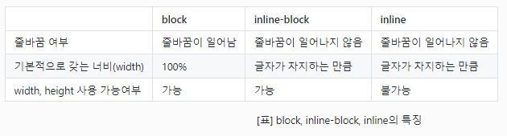
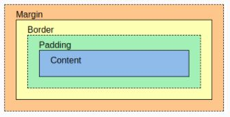
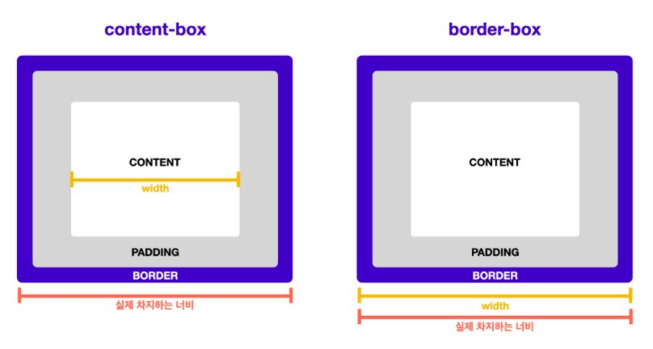

# 2021-07-26-TIL DAY 7

## CSS 기초
### CSS 구조

```css
body { // selector
  color: red; // 선언 - 속성명: 속성값
  font-size: 30px;
} // 선언 블록
```

- seletor는 태그 이름과 class, id를 선택
- 특성 요소를 선택했다면 중괄호 안에 이 요소에 적용할 내용 작성


### CSS 파일 추가

- CSS 파일에 작상된 내용을 HTML 파일에 적용하는 방법

```css
<link rel="stylesheet" href="index.css">
```

- link 태그
    - rel은 연결하고자 하는 파일의 역할이나 특징을 나타낸다.
    - href에는 파일의 위치를 추가한다.


## Selector
### id

- 특정 요소를 정확하게 선택하기 위해서는 엘리먼트에 id를 붙인다.

```css
<h4 id="navigation-title">This is the navigation section.</h4>
```

```css
#navigation-title {
  color: red;
}
```

- id 요소를 선택할 때에는 `#`기호를 사용한다.
- id는 하나의 문서에서 한 요소에만 적용해야 한다.


### class

- 동일한 기능을 하는 CSS를 여러 요소에 적용하기 위해 사용한다.

```css
<ul>
  <li class="menu-item">Home</li>
  <li class="menu-item">Mac</li>
  <li class="menu-item">iPhone</li>
  <li class="menu-item">iPad</li>
</ul>
```

```css
.menu-item {
  text-decoration: underline;
}
```

- class 요소를 선택할 때에는 `.` 기호를 사용한다.
- 반대로 여러 class를 하나의 요소에 적용할 수도 있다.
    - 공백을 통해 적용하려는 class의 이름을 분리한다.

```css
<li class="menu-item selected">Home</li>
```

```css
.selected {
  font-weight: bold;
  color: #009999;
}
```


## 텍스트 꾸미기
### 색상

```css
.red {
  color: #ff0000;
}
```

- 글자의 색상을 변경하는 속성은 color
- 속성값에는 HEX(16진수로 RGB; Red Green Blue가 표현된 값) 또는 주요 색상의 이름 사용


### 글꼴

```css
.emphasize {
  font-family: "SF Pro KR", "MalgunGothic", "Verdana";
}
```

- 글꼴의 이름은 따옴표를 붙여서 적용한다.
- 사용하려는 글꼴이 존재하지 않거나, 디바이스에 따라 지원하지 않을 수 있다.
    - 이 경우를 대비해 fallback 글꼴을 추가할 수 있다.
    - 입력된 순서대로 fallback이 적용된다.


### 크기

```css
.title {
  font-size: 24px;
}
```

- 알아야 할 몇가지 단위
    - 절대 단위: `px`, `pt` 등
    - 상대 단위: `%`, `em`, `rem`, `ch`, `vw`, `vh` 등
    - [단위에 대한 더 많은 정보](https://developer.mozilla.org/en-US/docs/Learn/CSS/Building_blocks/Values_and_units#numbers_lengths_and_percentages)
- 상황에 따라 사용하는 단위가 다르다.
    - 기기나 브라우저 사이즈 등의 환경에 영향을 받지 않는 절대적인 크기로 정하는 경우: `px` 사용
    - 일반적인 경우: `rem` 사용 추천
    - 반응형 웹(responsive web)에서 기준점을 만들 때: 디바이스 크기를 나누는 기준을 보통 `px`로 사용
    - 화면 너비나 높이에 따른 상대적인 크기가 중요한 경우: `vw`, `vh` 사용


### 정렬

- 가로 정렬: `text-align` 사용, 속성값으로 left, right, center, justify(양쪽 정렬)이 있다.
- 세로 정렬은 조금 더 복잡하다. 박스 모델과 레이아웃에서 다룰 예정


## 박스 모델

- 모든 콘텐츠는 각자의 영역을 가지며, 일반적으로 하나의 콘텐츠로 묶이는 엘리먼트(요소)들이 하나의 박스가 된다.
- 박스는 항상 직사각형이고, 너비(width)와 높이(height)를 가진다. CSS를 이용해 속성과 값으로 그 크기를 설정한다.


### 줄바꿈이 되는 박스(block) vs. 옆으로 붙는 박스(inline, inline-block)

- 박스의 종류는 줄바꿈이 되는 박스와 줄바꿈이 없이 옆으로 붙는 박스로 구분한다.
- 줄바꿈이 되는 박스는 block 박스, 줄바꿈이 일어나지 않고 크기지정을 할 수 없는 박스를 inline 박스라고 부른다.
    - Block 요소의 대표적인 예는 `<div>`, `<p>`
    - Inline 요소의 대표적인 예는 `<span>`
- inline-block 박스는 inline 박스처럼 다른 요소의 옆으로 붙으면서, 자체적으로 고유의 크기를 가진다. width, height 속성을 적용해 크기 지정을 할 수 있다.

```css
span {
  display: inline-block;
}
```






### border(테두리)

```css
p {
  border: 1px solid red; // p 태그에 1px의 빨간색 실선 추가
}
```

- border 속성에 적용된 각각의 값은 테두리 두께(border-width), 테두리 스타일(border-style), 테두리 색상(border-color)
- 테두리 스타일에 대한 다양한 세부 속성이 있다.
    - 점선
    - 둥근 모서리
    - 그림자

 

### margin(바깥 여백)

```css
p {
  margin: 10px 20px 30px 40px; // p 태그의 상하좌우에 여백 추가
}

// 각 값은 top, right, bottom, left 시계방향으로 적용
```

```css
p {
  margin: 10px 20px; // p 태그의 위아래와 좌우 각각 여백 추가
}
```

```css
p {
  margin: 10px; // p 태그의 모든 방향에 여백 추가
}
```

```css
p {
  margin-top: 10px;
  margin-right: 20px;
  margin-bottom: 30px;
  margin-left: 40px;
}

// 위와 같이 위치를 특정해 여백을 추가할 수도 있다.
```

```css
p {
  margin-top: -2rem;
}

// 음수 값을 지정할 수 있다. 여백에 음수 값을 지정하면 다른 엘리먼트와의 간격이 줄어든다. 극단적으로 적용하면, 화면(viewport)에서 아예 사라지게 하거나, 다른 엘리먼트와 겹치게 만들 수도 있다.
```


### padding(안쪽 여백)

```css
p {
  padding: 10px 20px 30px 40px; //p 태그의 padding 속성 상하좌우에 여백 추가
}

// 값의 순서는 margin과 동일
```


### 박스를 벗어나는 콘텐츠 처리

- 박스 크기보다 콘텐츠 크기가 더 큰 경우에는 콘텐츠가 박스 바깥으로 빠져나온다.
- overflow 속성을 사용하면 해결할 수 있다.
    - auto 값은 스크롤을 생성한다.
    - hidden 값은 콘텐츠 내용을 숨긴다.
    - x축과 y축을 지정해 스크롤할 수 있는 방법도 있다.


### 박스 크기 측정 기준

- 박스에 적용할 여백을 고려하지 않고 박스의 크기를 디자인하는 경우에 레이아웃을 벗어날 수 있다.
- 여백과 테두리 두께를 포함해 박스 크기를 계산하면 해결할 수 있다.

```css
* {
  box-sizing: border-box;
}
```

- 이렇게 모든 요소에 box-sizing: border-box를 적용하면, 모든 박스에서 여백과 테두리를 포함한 크기로 계산된다.




## JavaScript Calculator

: 코드스테이츠에서 JavaScript Calculator 과제를 하다 간단한 조건문에서 1시간 정도를 소요했다. 아래 개념을 정확히 파악하지 못해 생긴 일이었기 때문에 따로 정리해두었다.

> document.querySelector(".example");

- Get the first element in the document with class="example":

```html
<!DOCTYPE html>
<html>
  <body>
    <h2 class="example">A heading with class="example"</h2>
    <p class="example">A paragraph with class="example".</p> 
    <p>Click the button to add a background color to the first element in the document with class="example".</p>
    <button onclick="myFunction()">Try it</button>
    <script>
      function myFunction() {
      document.querySelector(".example").style.backgroundColor = "red";
      }
    </script>
  </body>
</html>

document.querySelector(".example")
// <h2 class="example">A heading with class="example"</h2>
```


### .textContent

- The `textContent` property of the Node interface represents the text content of the node and its descendants.

