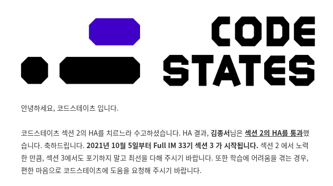
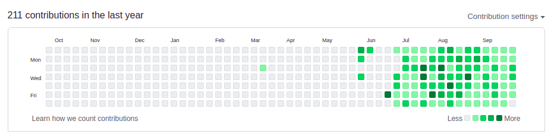

# 코드스테이츠 Section 2, 5주 간의 회고

9월 30일 오전, 한 통의 메일을 받았다. 코드스테이츠 섹션 2 HA 테스트를 무사히 통과했다는 소식이었다. 이 말은 다음 주부터는 섹션 3가 시작된다는 것이다. 섹션 2를 시작한 지 얼마 되지 않은 것 같은데, '벌써?'라는 생각과 함께 내가 무사히 섹션 2를 통과했다는 사실에 안도했다. 

우리 기수는 운이 좋았다. 섹션 2 HA 테스트 직전 추석 연휴로 일주일 정도 공부할 수 있는 시간을 확보할 수 있었다. 내 기준에서는 섹션 2 파트 전부를 복습하기에 충분한 시간이었다. 내 경우에는 연휴 기간 동안 총 이틀을 쉬었고, 나머지 시간에는 하루 6시간 ~ 10시간 정도를 공부에 투자했다.

이 글을 보고 있다면 섹션 2 과정이 궁금한 섹션 2를 막 시작하는 분들일 가능성이 높을 것이다. 그리고 이 글을 보는 당신은 우리 기수와 다르게 별도의 쉬는 날 없이 HA 테스트를 볼 것이다. 벌써부터 HA를 걱정하는 당신에게 용기를 주고 싶지만 운이 좋았던 33기인 나는 '나도 했다. 너도 할 수 있다'라는 식의 얘기는 해줄 수가 없다. 대신에 내가 지난 과정에서 느낀, 그리고 얻은 노하우를 전달해 주고자 한다.

## 1. 지난 5주간 무엇을 배웠는가?

### 1-1. 주차 별 내용

> **1주차 - [JS/Node] 객체 지향 JavaScript, [자료구조/알고리즘] 재귀, 자료구조 기초**
> **2주차 - [JS/Node] 비동기, [HTTP/네트워크] 기초, 실습**
> **3주차 - [React] 데이터 흐름의 이해와 비동기 요청 처리, [Web Server] 기초**
> **4주차 - [React] 컴포넌트 디자인, 상태 관리**
> **5주차 - [배포] 클라이언트 빌드와 배포, 섹션 2 HA**

이렇게 정리해보니 5주라는 짧은 기간 내에 참 많은 것을 배웠다는 사실을 새삼 깨닫는다. 코드스테이츠에 들어오기 전에는 독학을 해볼까도 생각 했었는데, 코드스테이츠를 하지 않았다면 꼭 필요한 부분을 이렇게 빠른 기간 안에 효율적으로 배우지 못했을 것이라는 생각이 든다. 들어오기 전에는 추후에 비용이 아깝지 않을까라는 걱정도 했지만 지금은 내 시간을 절약해준다는 느낌이 들어 오히려 남는 장사가 아닐까하는 생각까지 든다.

### 1-2. 섹션 2 공략집
{: width="100%" height="100%"}

섹션 2 과정을 한 줄로 요약하면 Frontend & Backend Basic으로 정리할 수 있다. 섹션 1에서 배운 React를 중심으로 프론트엔드를 학습하고, Node.js를 활용한 server의 기초를 배운다. 이외에도 JS의 주요 문법인 객체 지향과 비동기를 배우고, 알고리즘에서 중요하게 다뤄지는 재귀 방식과 Stack, Queue 등의 자료구조를 학습한다.

섹션 2를 시작하게 되면 아마 첫 주가 고비일 것이다. 처음 배우는 객체 지향은 '할만한데?'라고 느낄지 모르지만 이후에 [자료구조/알고리즘] 재귀와 자료구조 기초 파트에서는 벽을 만날 것이다. 나는 자료구조를 배우던 날 내 뇌 기능을 의심하면서 '개발자는 내 길이 아닐지도 몰라'라는 생각에 허우적댔었다. 결국 개발자 지인에게 상담을 받기도 했다.

만약 나와 같은 상황에 부딪힌다면, 나만 어렵게 느끼고 있는 것이 아니라는 사실을 상기해야 한다. 나뿐만 아니라 다른 대부분의 교육생도 마찬가지로 힘겨워하고 있을 것이다. 당신의 뇌 기능은 문제가 아니다. 당시, 섹션 1에서 만난 페어 분들과 소통했을 때, 대부분 나와 같은 걱정을 하고 있었다. 멘탈을 부여잡고 '할 수 있다'며 서로를 위로해 줬던 기억이 생생하다.

또한 섹션 2에서는 매일 아침 9시부터 10시까지 1시간 동안 Toy Problem을 해결하는 시간을 가진다. 코딩 테스트 준비를 위한 알고리즘 문제를 푸는 것으로 이해하면 될 것이다. 여기서 문제는 Toy Problem의 난이도이다. 1번 문제부터 '이걸 풀라고 내준 건가?'라는 생각과 함께 코드스테이츠 하면 '불친절'이라는 단어가 가장 먼저 떠오를 것이다.

하지만 사람은 적응의 동물이 아닌가. 2주 차부터는 이 상황에 적응이 될 것이다. 코드스테이츠에서는 이걸 노린 게 아닌가 싶다. 이후에 배우는 내용이 상대적으로 쉽게 느껴지는 효과를 얻을 수 있다. 물론 생소하고, 복잡한 개념이 계속 등장할 것이다. 여기서 적용해야 할 것은 '먼저 익숙해져라.'이다. 많이 보다 보면 익숙해지고, 익숙해지면 이해할 수 있다.

가끔 코드스테이츠의 개념 내용이 부족하다는 생각이 들 것이다. 그럼 다시 '불친절'이라는 단어가 떠오를 것인데, 감정을 잘 추스르고 구글과 유튜브에서 개념을 보충하길 바란다. 특히, 비동기 내용은 유튜브에 찾아보면 이해를 돕는 영상을 찾아볼 수 있다. 나는 드림코딩 채널을 자주 애용했다.

3주 차 React 파트에 들어가면 이제 좀 할만하다고 느낄 것이다. 자신이 성장했음을 느낌과 동시에 '코드스테이츠가 나를 강하게 키우기 위함일지도...?'라는 숨겨진 의도를 유추해 내면서 모든 것이 용서되기 시작한다. 그렇게 4주 차, 5주 차가 순식간에 지나가고, HA 테스트를 맞이하게 될 것이다.

## 2. 내가 HA를 무사히 통과할 수 있었던 이유

### 2-1. 혼자 가면 빨리 가지만 함께 가면 멀리 간다.
{: width="100%" height="100%"}

이 명언은 우리가 흔히 들어볼 수 있는 명언이다. 하지만 나는 개인적으로 실제 삶에서 이 명언이 적용되는 경우를 거의 겪지 못했던 것 같다. 내 경우에는 코드스테이츠에서 스터디를 하면서 이 명언의 진정한 의미를 깨달을 수 있었다.

섹션 2에 들어간 직후, 섹션 1에서 만난 페어 분의 제안으로 4명의 인원으로 구성된 스터디를 시작하게 되었다. 매일 저녁 9시부터 10시까지 당일 풀어본 Sprint 또는 Toy Problem에 대한 서로의 의견을 주고받는 방식으로 진행하고 있다. 이해되지 않는 부분이 있다면, 이해한 사람이 설명해 주고, 각자의 코드를 보면서 왜 이렇게 코드를 짰는지, 어떤 코드가 더 효율적인지 의견을 나눈다.

이 과정에서 자신이 설명해 주는 입장이라면 이를 자신의 언어로 설명함으로써 복습할 수 있고, 설명을 듣는 입장이라면 해당 개념을 이해하는데 투자해야 하는 시간을 절약할 수 있다. 또한, 각자의 성격만큼이나 다른 코드를 공유해 더욱 효율적이고, 클린한 코드를 작성하기 위한 과정에서 사고를 확장시켜 나갈 수 있다.

그중에서도 내가 생각하는 스터디의 가장 큰 장점은 한 목표를 위해 달려가는 동료가 생긴다는 것이다. 혼자서 공부할 때는 채울 수 없는 지식과 정보를 얻을 수 있음은 물론이고, 공부를 지속할 수 있는 힘을 얻을 수 있다. 다른 말로 동기 부여라고 말할 수 있는데, 이는 함께 할 때는 소속감, 열심히 하지 않을 때는 열등감, 열심히 할 때는 경쟁심 등의 형태로 찾아온다.

하지만 누구에게나 스터디를 추천하는 것은 아니다. 오히려 혼자 공부하는 것이 본인에게 맞는 사람이 있고, 해당 스터디의 운영 방식과 정원, 인원 간의 관계 등의 요소를 고려해야 하기 때문이다. 본인에게 맞지 않는 옷을 입는다면, 오히려 그 시간이 불편할 수 있을 것이다. 개인적으로 인원은 4인 내외가 적당하다고 생각된다.

### 2-2. '깐부' 프로그래밍?

최근 드라마 '오징어 게임'이 전 세계적으로 인기를 얻고 있다. 여기서 유명한 '깐부'라는 단어가 나오는데, 뜻은 다음과 같다.

> **구슬이나 딱지치기 등의 놀이를 할 때 내 것, 네 것 구분 없이 새끼손가락 걸며 함께하는 동지 또는 짝꿍을 의미합니다.**
> 

나에게는 코드스테이츠에서 만난 조승우 닮은 훈남 깐부가 있다. 우리는 코드스테이츠에서 첫 페어로 만났다. 굳이 엮어보자면 극 중에서 456번이 1번에게 첫 번째로 말을 건 것이 오버랩된다. 우리는 매일 저녁 8시에 만나 새벽 1시까지 프로그래밍 공부를 한다. 여기서 만난다는 것은 화상 채팅을 의미한다. 주말에도 서로 일정이 없다면, 보통 아침 10시에 만나 밤늦게까지 공부한다. 공부를 하는 도중 궁금한 것이 있으면, 서로 자연스럽게 질문을 던진다. 자신이 아는 선에서 최대한 답변을 주고, 모른다면 함께 찾아보면서 공부를 한다. 서로의 공부에는 내 것, 네 것 구분이 없다.

단지 프로그래밍 공부만 함께 했던 것은 아니다. 코드스테이츠에 들어오기 전에는 무슨 일을 했는지, 개발자로서 목표는 무엇인지 등 서로를 알아가기도 했다. 내 깐부는 하늘과 관련된 일을 했었고, 앞으로는 '마이리얼트립'이라는 여행 플랫폼 회사에 입사하는 것이 단기적인 목표라고 말했다. 일본으로 여행을 자주 다녔고, 혼자 여행하는 것을 즐긴다. 그와 이야기 나누는 것은 정말 즐겁다. 가끔은 깐부를 만난 것만으로도 코드스테이츠에 들어오길 잘했다는 생각이 들기도 한다. 우리는 아직 실제로 얼굴을 마주한 적은 없지만, 지금의 나를 가장 잘 아는 사람은 내 깐부일 것이다. 

나는 우리가 하는 공부 방식을 '페어' 프로그래밍 보다 한 단계 높은 '깐부' 프로그래밍으로 칭하고 싶다. 페어 프로그래밍이 학습에 도움 된다고 하면, '깐부' 프로그래밍은 여기에 플러스로 정서적으로 도움이 될 수 있다. 스터디할 때와 같은 맥락이지만 더 깊게 한 가지 목표를 공유한다. 또한, 같은 환경에 비슷한 고민을 하는 사람과 함께 한다는 것만으로도 안정감을 가질 수 있다. 힘들 때는 누구보다 공감해 줄 수 있다. 자신과 쿵짝이 잘 맞는 '깐부'를 만난다면, 프로그래밍 공부의 힘듦은 반으로, 즐거움은 배로 커질 것이다.

## 3. 섹션 3, 그리고 앞으로의 계획

### 3-1. 블로그 TIL & 잔디 심기

코드스테이츠에 들어오고 나서 결심한 것이 있다. github에 매일 잔디를 심고, 블로그에 TIL을 꾸준히 작성하는 것이다. 나에게만 보이는 잔디 2개로 인해 잔디에 구멍이 나기도 하고, 주말 간 타 일정으로 TIL 작성을 건너뛴 경우가 있지만 위에서 볼 수 있다시피 잘 이행해 나가고 있다. 

> github 블로그를 활용하면 블로그 TIL 작성으로 잔디를 심을 수 있다.
> 

블로그 TIL과 잔디 심기를 하는 이유는 크게 2가지이다.

1. 내 개인 학습에 도움이 된다.
- 글로 옮기는 작업에서 복습이 되고, 매일 꾸준히 올림으로써 공부 습관을 형성할 수 있다. 지금은 잔디가 끊기는 것을 참을 수 없다.

2. 취업 시 포트폴리오로 제출할 수 있다.
- 취업 시에 성실도와 학습 태도를 보여줄 수 있는 포트폴리오로 제출할 수 있다. 세부 내용은 면접관에 따라 관점은 다를 수 있지만 모든 경우에 적어도 +(플러스)는 될 것이라고 생각한다.

블로그 TIL은 취업할 때까지 지속할 계획이다. 취업한 이후에는 퀄리티 있는 테크 블로그를 운영하고 싶다.

### 3-2. 섹션 3 Preview & 다짐

다음 주부터 섹션 3가 시작된다. 섹션 3에서는 백엔드를 중심으로 배우게 되는데, 나는 이전부터 백엔드 엔지니어를 목표했기 때문에 더 기대가 된다. 마지막으로는 섹션 3에서 배울 내용에 대해 간단히 알아보고, 다짐으로 마무리 해보려 한다.

> **[Linux] - 심화 ⇒ [자료구조/알고리즘] - 코딩 테스트 준비 ⇒ [데이터베이스] - 관계형 데이터베이스  ⇒ [데이터베이스] - MVC  ⇒ [데이터베이스] - NoSQL ⇒ [인증/보안] - 기초 ⇒ [컴퓨터 공학] - 기초 ⇒ [네트워크] - 심화 ⇒ [Git] - 브랜치 관리와 고급 기능 ⇒ [배포] - Amazon Web Service ⇒ [배포] - Docker ⇒ [배포] - 배포 자동화**

앞으로 배울 내용이다. 1주 차의 자료구조를 보니 살짝 PTSD가 오려고 한다. 얼른 데이터베이스로 넘어가 보자. 데이터베이스는 백엔드에서 중요한 개념이라 그런지 관계형 데이터베이스, MVC, NoSQL 세 파트로 나뉘고, 가장 큰 비중을 차지한다. 이후에는 인증과 보안, 컴퓨터 공학 기초를 배우고, 섹션 1과 2에서 배운 적 있는 네트워크와 Git, 배포를 더욱 심화해서 다룬다. 섹션 3 내용 또한 생소하고 복잡해 보이지만 언제나 그랬듯 잘 헤쳐나갈 수 있을 것이다.

나는 앞으로 공부 습관을 만드는 것에 중점을 둘 것이다. 개발자는 끊임없이 공부해야 하고, 실력을 갈고닦아야 하는 직업이다. 결국, 제대로 된 공부 습관은 나를 유능한 개발자로 인도할 것이다. **처음에는 우리가 습관을 만든다. 하지만 그다음에는 습관이 우리를 만든다.**
