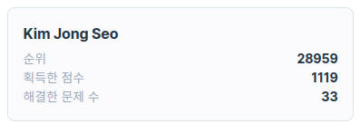

# 프로그래머스 목표, Auth(인증) 개념

## [오늘의 해결]

{: width="100%" height="100%"}
- 오늘은 프로그래머스 level 1 5문제를 풀었다. 최근에 목표를 세운 것이 있는데, 코드스테이츠를 수료하기 전까지 프로그래머스 level 3을 풀 정도의 실력을 갖추는 것이다. 점수 올리는 재미가 꽤나 쏠쏠해 앞으로 꾸준히 할 수 있을 것 같다. 현재 내 점수는 1119점이다. 과연 몇점까지 올릴 수 있을까.
- 지난 주에 게을러 풀지 않았던 Toy Problem 2문제를 풀어보았다. 한 문제는 해결했으나, 한 문제는 문제 조차 이해되지 않았다. 내일 스터디에서 질문할 것. 앞으로는 제때 풀 것.
- 쿠키, 세션, 토큰, JWT에 대한 영상을 시청했다. 섹션 3에서 배울 내용을 미리 예습한다는 느낌이었다. 생소했지만 전반적인 내용은 이해할 수 있었다. 개념을 배운 다음 다시 본다면 정리가 잘 될 것 같다.
    
    참고: [youtube.com/watch?v=tosLBcAX1vk&t=317s](http://youtube.com/watch?v=tosLBcAX1vk&t=317s)
