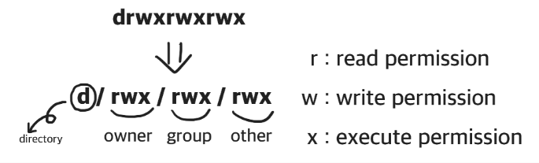
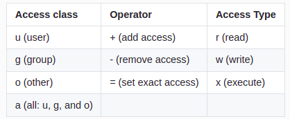
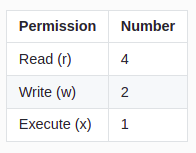
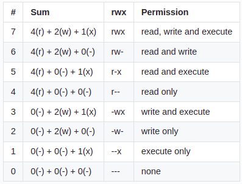

# linux 심화

## [오늘의 해결]

### linux 심화

- **사용 권한**
    - 터미널에서 `ls -l` 명령어를 입력하면, 파일의 상태를 출력할 수 있다. 폴더는 `drwxr-xr-x`, 파일은 `rw-r--r--` 로 출력된다. 이 표현의 첫 시작인 - 와 d 는 각각 not directory와 directory를 나타낸다. 폴더이면 d로, 파일이면 - 로 나타내는 것이다.
    - 이어지는 r, w, x는 각각 read permission, write permission, execute permission으로 읽기 권한, 쓰기 권한, 실행 권한을 나타낸다.
    - 파일의 권한은 `rw-r--r--` 으로, 소유자는 읽기와 쓰기가 가능하고, 다른 사용자 그룹은 읽기만 가능하다는 의미이다. 폴더 linux의 `권한은 rwxr-xr-x` 으로, 소유자는 읽기와 쓰기, 실행이 가능하고, 다른 사용자 그룹은 읽기와 실행만 가능하다.
    
    - **owner, group, and other**
        
    
	  
	1. owner: owner는 파일의 소유자입니다. 기본적으로 파일을 만든 사람이 소유자가 된다. 따라서 owner를 소유자라고 하기도 한다.
	    
	2. group: group에는 여러 user가 포함될 수 있다. 그룹에 속한 모든 user는 파일에 대한 동일한 group 액세스 권한을 갖는다. 많은 사람이 파일에 액세스해야 하는 프로젝트가 있다고 가정한다. 각 user에게 일일이 권한을 할당하는 대신에 모든 user를 group에 추가하고, 파일에 group 권한을 할당할 수 있다.
	    
	3. other: 파일에 대한 액세스 권한이 있는 다른 user이다. 파일을 만들지 않은 다른 모든 user를 의미한다. 따라서 other 권한을 설정하면, 해당 권한을 global 권한 설정이라고 볼 수도 있다.
	    
	- **chmod: 권한을 변경하는 명령어**
	    - 폴더나 파일의 읽기, 쓰기, 실행 권한을 변경할 수 있다.
	    - OS에 로그인한 사용자와, 폴더나 파일의 소유자가 같을 경우에 명령어 `chmod`로 폴더나 파일의 권한을 변경할 수 있다.
	    - 만약 OS에 로그인한 사용자와, 폴더나 파일의 소유자가 다를 경우에는 관리자 권한을 획득하는 명령어 `sudo`를 이용해 폴더나 파일의 권한을 변경할 수 있다.
	    - **명령어 `chmod`로 권한을 변경하는 방식**
		
		1. 더하기(+), 빼기(-), 할당(=)과 액세서 유형을 표기해서 변경하는 Symbolic method
		    
		    
		    - 명령어 chmod 뒤에 변경할 권한을 입력한다. 액세스 클래스의 u, g, o, a를 변경할 조건에 따라 조합하여 입력하고, 연산자와 액세스 타입을 순서대로 입력한다.
		    - 예시: `chmod g-r filename # removes read permission from group`
		
		
		2. rwx를 3 bit로 해석하여, 숫자 3자리로 권한을 표기해서 변경하는 Absolute form
		    
		    
		    
		    
		    - Absolute form은 숫자 7까지 나타내는 3 bits의 합으로 표기한다.
		    - 예시:
		    
		    ```jsx
		    # u=rwx (4 + 2 + 1 = 7), go=r (4 + 0 + 0 = 4)
		    chmod 744 helloworld.js # -rwxr--r--
		    ```
		    
		    - Absolute form의 숫자별 권한
			
		    
			
                    

- **환경변수**
    - `export` 명령어로 기록된 환경변수를 확인할 수 있다.
    - `export urclass="새로운 환경 변수"` 명령어로 새로운 환경변수를 추가할 수 있다. 이때, 등호 표시(Equal sign, =) 앞뒤에는 반드시 공백이 없어야 한다.
    - `echo` 명령어와 함께 환경변수를 입력하면, 환경변수의 값을 확인할 수 있다. 이때 환경변수의 앞에는 달러사인($)을 입력하여, 변수라는 뜻을 터미널에 전달한다. `echo $urclass`을 입력하면 is good이 출력된다.
    
    - **dotenv: 자바스크립트에서 환경변수 사용하기**
        - `process.env` 는 Node.js 환경에서 조회할 수 있다.
        - dotenv는 .env 파일을 환경변수로 사용할 수 있게 돕는다.
    
    ```
    npm init # 엔터 키를 여러번 입력해 init을 마친다.
    npm i dotenv # dotenv 모듈을 설치한다.
    
    설치한 dotenv를 이용해 환경변수에 접근할 수 있다. 새로운 파일 index.js를 생성하고, process.env를 출력한다. Node.js의 내장 객체 process.env를 이용하면, 명령어 export로 확인한 내용과 동일한 내용을 객체로 출력한다.
    ```
    
    - **.env: Node.js에서 환경변수 영구 적용**
        - Node.js에서는 파일 .env를 만들어 저장하는 방법을 사용한다.
        - env 파일을 생성하고, 사용하고자 하는 환경변수를 입력한 뒤 저장한다.
        
        ```jsx
        nano .env
        ```
        
        - 모듈 dotenv를 이용하면, 파일 .env에 저장한 환경변수를 조회할 수 있다.
        
        ```
        const dotenv = require("dotenv");
        dotenv.config();
        console.log(process.env.myname);
        ```
        
        - index.js에서 dotenv.config 메소드를 이용해, .env를 process.env에 적용할 수 있다.
        - 환경변수를 이용해 API key, DB password와 같이 민감한 정보를 저장하고 관리할 수 있다. 그뿐만 아니라 서로 다른 PC 또는 여러 .env 파일에서, 같은 변수 이름에 다른 값을 할당할 수 있다.
        - 실제 제품(서비스)을 개발하는 과정에는 개발 환경(local 또는 development 등)과 테스트 서버의 환경(test), 그리고 실제 제품을 제공하는 환경(production)이 있다. 개발 환경과 제품을 제공하는 환경에서 사용하는 API 키가 다른 경우, 환경변수를 이용해 환경을 구분하여 코드를 작성할 수 있다.
        

### Sprint Review 정리

- sudo: 일반 사용자가 root 권한(관리자 권한)을 빌려 명령어를 실행할 때, 활용할 수 있는 커맨드
- su(switch user): 계정 전환 `su 계정명`
- chmod로 권환 설정을 해주어야 하는 이유는 내가 만든 파일 또는 디렉토리를 누군가 마음대로 수정하거나 삭제하지 못하게 하기 위함이다. 문제가 발생할 수 있기 때문에 사전에 권한을 부여한다.
- root, admin, user
    1. root: 해당 시스템 전체의 관리 권한을 가진 전지전능한 슈퍼 유저
    2. admin: 일반 유저지만 root가 관리 권한을 줄 수 있다.
    3. user: 일반 유저, `whoami` 커맨드로 확인할 수 있다.
- linux 명령어를 활용하면 환경변수 설정을 자동화시킬 수 있다. 개발자 사이에서 소통할 때, 대화가 아닌 문서로 처리할 수 있다.
- 환경변수는 프로세스가 컴퓨터에서 동작하는 방식에 영향을 미치는 동적인 값들의 모임이다. 운영체제가 동작 하는데 필요한 변수들의 모임이라고도 할 수 있다.
- db 비밀번호를 .env에 설정했다면, gitignore에 .env를 추가해 보안을 지킬 수 있다. db 외에도 api key와 같은 환경변수도 .env에 설정할 수 있다.

참고: [https://youtu.be/EL6AQl-e3AQ](https://youtu.be/EL6AQl-e3AQ)
