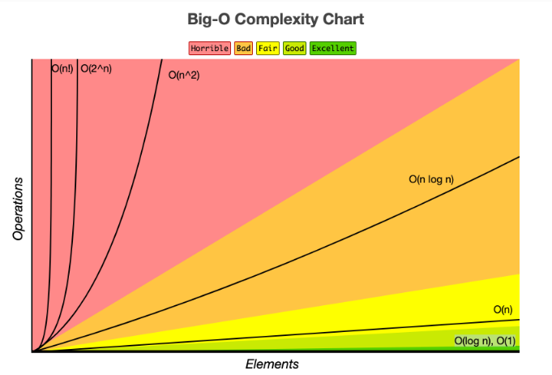

# [자료구조/알고리즘] 코딩 테스트 준비

### Time Complexity

- 시간 복잡도: 입력값의 변화에 따라 연산을 실행할 때, 연산 횟수에 비해 시간이 얼마만큼 걸리는가?
- Big-O 표기법: 시간 복잡도를 나타내는 표기법
    - **Big-O**(빅-오)
    - Big-Ω(빅-오메가)
    - Big-θ(빅-세타)
    
    : 위 세 가지 표기법은 시간 복잡도를 각각 최악, 최선, 중간(평균)의 경우에 대하여 나타내는 방법, 이 중에서 Big-O 표기법이 가장 자주 사용된다. 빅오 표기법은 프로그램이 실행되는 과정에서 소요되는 최악의 시간까지 고려할 수 있기 때문이다. "이 정도 시간까지 걸릴 수 있다"를 고려해야 그에 맞는 대응이 가능하다.
    

### Sprint Review 정리

- 대부분 코딩 테스트 문제는 실행 시간 1초에 가깝게 디자인되어 있다. 보통 1억 연산 당 1초가 걸린다.
- 주어진 데이터의 크기로 어떤 알고리즘을 사용해야 하는지 파악할 수 있다. O(n)은 100,000,000, O(nlogn)은 5,000,000, O(n^2)는 10,000.
- 공간 복잡도는 보통 시간 복잡도를 충족했다면 신경쓰지 않아도 된다. JS에서 보통 변수 하나는 8Byte. 메모리 조건으로는 128, 256, 512MB가 가장 많이 등장한다. KB = 1024Byte, MB = 1024KB.
- 코딩 테스트 전, GCD, 순열과 조합, Sort, DFS, BFS, 분할 정복(재귀), DP를 꼭 복습할 것.
- Backtracking, Dvide and Conquer, Graph Algorithm: 대부분의 문제는 이 세가지 유형에서 거의 다 나오기 때문에, 해당 알고리즘 위주로 학습하면 된다. Greedy, Dynamic Programming는 약간 난이도가 높은 문제이기 때문에, 위의 세 가지 유형을 공부한 후 학습하시면 좋다. Searching, Sorting은 주어진 함수를 쓰는 것이 좋다. (자바스크립트에서는 Array.prototype.sort)[Advanced] Randomized Algorithms: 휴리스틱한 유형이기 때문에 입사 코딩테스트 문제로는 거의 나오지 않는다.
- 추천 사이트: [https://www.geeksforgeeks.org/dynamic-programming/?ref=ghm](https://www.geeksforgeeks.org/dynamic-programming/?ref=ghm)

### 그리디와 DP 간단 정리

- 그리디 알고리즘은 모든 해를 구하지 않고 순간마다 그 순간에서의 최적의 해를 찾는 방식이다. 그리디 알고리즘은 닥친 순간만을 고려하여 해를 구하기 때문에 도출된 값이 항상 최적의 해라고 할 수는 없다. 반면에 동적 계획법은 모든 방법을 검토해 보고 결과적으로 효율적인 값을 도출한다. 그런 면에서 동적 계획법은 그리디 알고리즘에 비해 시간이 오래 걸리지만, 결과적으로는 항상 최적의 해를 구할 수 있다는 이점을 가지고 있다.
