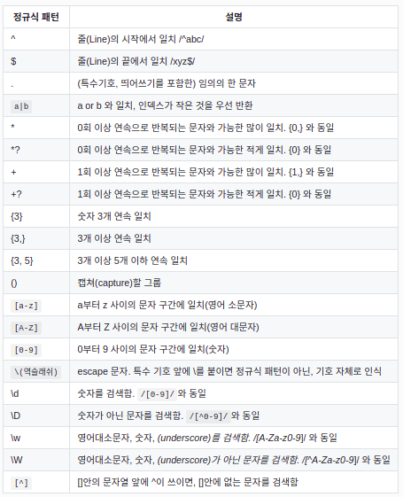

# 정규표현식

## [오늘의 해결]

### 정규표현식 사용하기

**리터럴 패턴**

```jsx
let pattern = /c/;

// 정규표현식 규칙을 슬래시(/)로 감싸 사용한다.
// 슬래시 안에 들어온 문자열이 찾고자 하는 문자열
```

**생성자 함수 호출 패턴**

```jsx
let pattern = new RegExp('c');

// new를 이용해서 정규 표현식 객체를 생성하고,
// 리터럴 패턴과 동일하게 'c'를 찾는다.
```

### 정규표현식 내장 메소드

**RegExp 객체의 메소드**

- exec(): exec는 execution 의 줄임말로, 원하는 정보를 뽑아내고자 할 때 사용한다. 검색의 대상이 찾고자 하는 문자열에 대한 정보를 가지고 있다면 이를 배열로 반환하며, 찾는 문자열이 없다면 null을 반환한다.

```jsx
let pattern = /c/; // 찾고자 하는 문자열
pattern.exec('codestates') // 검색하려는 대상을 exec 메소드의 첫 번째 인자로 전달

// 'codestates' 가 'c' 를 포함하고 있는지를 확인
// 이 경우 'c' 가 포함되어 있으므로, ['c'] 를 반환
```

- test(): 찾고자 하는 문자열이 대상 안에 있는지의 여부를 boolean 으로 리턴한다.

```jsx
let pattern = /c/;
pattern.test('codestates');
// 이 경우는 'codestates'가 'c'를 포함하고 있으므로 true를 리턴
```

**String 객체의 메소드**

- match(): RegExp.exec()와 비슷한 기능을 하며, 정규 표현식을 인자로 받아 주어진 문자열과 일치된 결과를 배열로 반환한다. 일치되는 결과가 없으면 null 을 리턴한다.

```jsx
let pattern = /c/;
let str = 'codestates';
str.match(pattern);
// str 안에 pattern이 포함되어 있으므로, ['c']를 반환
```

- replace(): '검색 후 바꾸기'를 수행한다. 첫 번째 인자로는 정규표현식을 받고, 두 번째 인자로는 치환하려는 문자열을 받는다. 문자열에서 찾고자 하는 대상을 검색해서 이를 치환하려는 문자열로 변경 후 변경된 값을 리턴한다.

```jsx
let pattern = /c/;
let str = 'codestates';
str.replace(pattern, 'C');
// str 안에서 pattern 을 검색한 후 'C'로 변경하여 그 결과를 리턴
// 'Codestates'가 반환
```

- search(): 정규표현식을 인자로 받아 가장 처음 매칭되는 부분 문자열의 위치를 반환한다. 매칭되는 문자열이 없으면 -1을 반환한다.

```jsx
"JavaScript".search(/script/); // -1 대소문자를 구분한다.
"JavaScript".search(/Script/); // 4
"codestates".search(/ode/); // 1
```

**flag**

정규표현식은 플래그를 설정해 줄 수 있으며, 플래그는 추가적인 검색 옵션의 역할을 한다. 이 플래그들은 각자 혹은 함께 사용하는 것이 모두 가능하며, 순서에 구분이 없다.

- i: i를 붙이면 대소문자를 구분하지 않는다.

```jsx
let withi = /c/i;
let withouti = /c/;
"Codestates".match(withi); // ['C']
"Codestates".match(withouti); // null
```

- g: global의 약자로, g를 붙이면 검색된 모든 결과를 리턴한다.

```jsx
let withg = /c/g;
let withoutg = /c/;
"coolcodestates".match(withg); // ['c', 'c']
"coolcodestates".match(withoutg); // ['c'] g가 없으면 첫 번째 값만 반환
```

- m: m을 붙이면 다중행을 검색한다.

```jsx
let str = `1st : cool
2nd : code
3rd : states`;
str.match(/c/gm)
// 3개의 행을 검색하여 모든 c를 반환
// ['c', 'c']
str.match(/c/m)
// m은 다중행을 검색하지만 g를 빼고 검색하면 검색 대상을 찾는 순간 검색을 멈춘다.
// 첫 행의 ['c']만 리턴
```

**정규식 패턴(표현식)**


