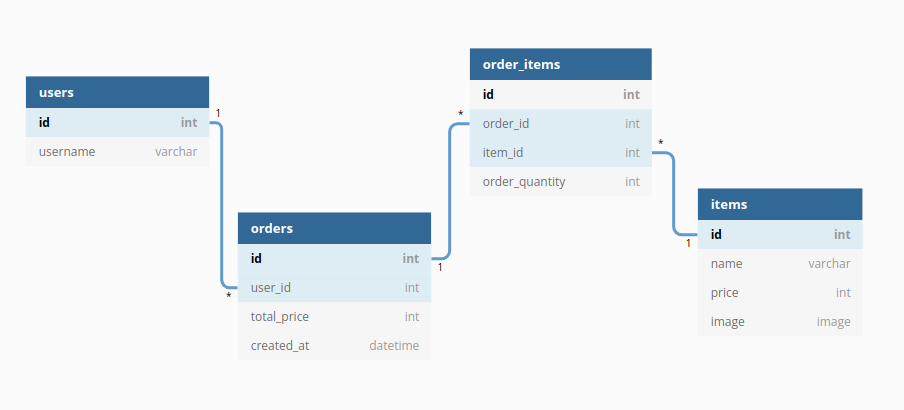

# MVC, cmarket Sprint

## [오늘의 교훈]

- 이번 Sprint에서 갑자기 npm으로 test 돌리는 속도가 급격히 저하되었다. 몇 초면 되었던 것이 10분이 되어도 완료되지 않았다. 문제를 해결하기 위해 npm의 캐시를 모두 지워보기도 하고, npm과 node를 재설치하기도 했다. 이외에도 여러 시도를 했지만 결국 해결하지 못했다. 이내 나의 문제 해결 접근 방법이 옳지 않았다는 것을 깨달았다. 이전에 했던 스프린트와 앞으로 할 스프린트에서 잘 작동하는지 확인하는 것이 우선시 되어야 했다. 실제 npm에 문제가 있는지 확인하는 과정이 생략되었다. 직관적으로 문제를 바라본 것이다.

- 서버와 관련한 내용을 본격적으로 배우기 시작했다. 관계형 데이터베이스와 MVC 모델을 배우면서 흥미를 느낌과 동시에 왜인지 모를 불편함이 느껴졌다. 깊게 생각해보니 그 이유가 무엇인지 알 수 있었다. 지금까지 프론트엔드 파트를 배울 때는 나는 백엔드를 지망하기 때문에 프론트엔드는 이정도만 알아도 되겠지하는 안일한 마음이 있었다. 그런데 백엔드 파트를 학습할 때에도 이러한 공부 태도가 그대로 드러나고 있었다. 공식 문서를 꼼꼼히 들여다보고, 더 적극적으로 학습해 나갈 필요가 있다.

## [오늘의 해결]

- 스키마 디자인 작성할 때는 orders와 items의 관계를 고려하지 않고, orders와 order_items의 관계가 N:M의 관계가 아닌지를 의심했다. 결과적으로는 알맞게 작성되었지만 어리석은 모습을 반성한다.

- mysql 문법에서는 queryString에 들어올 params가 결정되지 않았을 때는 ? 기호를 사용한다. params는 배열 형태로 넣어줘야 한다. result는 객체를 가지는데, 이 객체 안에 있는 insertId는 INSERT INTO될 때, id 값을 가지게 된다. 중첩된 배열 형태로 값이 들어가게 되면 ?는 하나만 작성해도 된다.

```sql
const queryString = `INSERT INTO order_items (order_id, item_id, order_quantity) VALUE ?`;

db.query(queryString, [params], (error, result) => {
	callback(error, result);
```

- 2개 이상의 Table에 INSERT INTO할 때는 PK 요소가 있는 데이터를 먼저 삽입하고, 그 PK가 FK에 들어갈 수 있는 데이터를 삽입한다. UPDATE나 DELETE의 경우에는 어떠한지 알아봐야겠다. query문 안에 query문을 작성하는 형태이다.
- 
- `git restore .` 는 git clone한 파일을 원래 상태로 돌려주는 커맨드이다. 지금까지는 해당 파일을 지우고 다시 다운 받는 형식으로 진행했다. 개발자라면 응당 불편함을 느끼면 그 문제를 해결하기 위해 노력해야 하지만 아직 갈길이 멀다.
