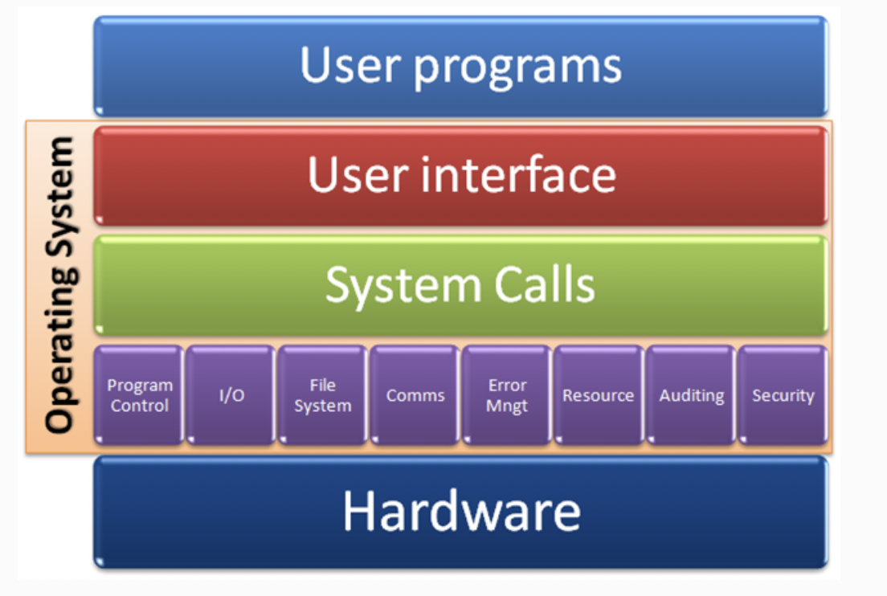
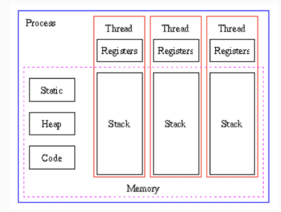

# 문자열, 운영체제, 프로세스, 스레드, 가비지 컬렉션, 캐시

## 문자열

### **유니코드**(Unicode)

유니코드 협회(Unicode Consortium)가 제정하는 전 세계의 모든 문자를 컴퓨터에서 일관되게 표현하고 다룰 수 있도록 설계된 산업 표준이다. 이 표준에는 ISO 10646 문자 집합, 문자 인코딩, 문자 정보 데이터베이스, 문자를 다루기 위한 알고리즘 등을 포함하고 있다. 기본적으로 유니코드의 목적은 현존하는 문자 인코딩 방법을 모두 유니코드로 교체하는 것이다.

### **ASCII 문자**

영문 알파벳을 사용하는 대표적인 문자 인코딩으로 7 비트로 모든 영어 알파벳을 표현할 수 있다. 52개의 영문 알파벳 대소문자와, 10개의 숫자, 32개의 특수 문자, 그리고 하나의 공백 문자를 포함한다.

### **UTF-8과 UTF-16**

UTF-8과 UTF-16은 인코딩 방식의 차이를 의미한다. UTF-8은 Universal Coded Character Set + Transformation Format – 8-bit의 약자로, UTF- 뒤에 등장하는 숫자는 비트(bit)이다.

1. **UTF-8 특징: 가변 길이 인코딩**

UTF-8은 유니코드 한 문자를 나타내기 위해 1 byte(= 8 bits)에서 4 bytes까지 사용한다.

- 원리

예를 들어, `코` 라는 문자의 유니코드는 `U+CF54` (16진수, HEX)로 표현된다. 이 문자를 이진법(binary number)으로 표시하면, `1100-1111-0101-0100`이 된다. 이 문자를 UTF-8로 표현하면, 다음과 같이 3 bytes 의 결과로 표현된다.

```jsx
1110xxxx 10xxxxxx 10xxxxxx # x 안에 순서대로 값을 채워넣는다.
11101100 10111101 10010100
```

```jsx
let encoder = new TextEncoder(); // 기본 인코딩은 'utf-8'
encoder.encode('코') // Uint8Array(3) [236, 189, 148]

(236).toString(2) // "11101100"
(189).toString(2) // "10111101"
(148).toString(2) // "10010100"
```

UTF-8은 1 byte에서 4 bytes까지의 가변 길이를 가지는 인코딩 방식이다다. 네트워크를 통해 전송되는 텍스트는 주로 UTF-8로 인코딩된다. 사용된 문자에 따라 더 작은 크기의 문자열을 표현할 수 있기 때문이다. UTF-8은 ASCII 코드의 경우 1 byte, 영어 외 글자는 2bytes, 3bytes, 보조 글자는 4bytes를 차지한다. 이모지는 보조 글자에 해당하기 때문에 4bytes가 필요하다.

**2. UTF-8 특징: 바이트 순서가 고정됨**

UTF-16에 비해 바이트 순서를 따지지 않고, 순서가 정해져 있다.

**3. UTF-16 특징: 코드 그대로 바이트로 표현 가능, 바이트 순서가 다양함**

UTF-16은 유니코드 코드 대부분(U+0000부터 U+FFFF; BMP)을 16 bits로 표현한다. 대부분에 속하지 않는 기타문자는 32 bit(4 bytes)로 표현하므로 UTF-16도 가변 길이라고 할 수 있으나, 대부분은 2 bytes로 표현한다. U+ABCD라는 16진수를 있는 그대로 이진법으로 변환하면 `1010-1011-1100-1101`이다. 이 이진법으로 표현된 문자를 16 bits(2 bytes)로 그대로 사용하며, 바이트 순서(엔디언)에 따라 UTF-16의 종류도 달라진다. UTF-8에서는 한글은 3 bytes, UTF-16에서는 2 bytes를 차지한다.

## 운영체제 개요

### 1. 운영체제

**시스템 자원 관리**



운영체제가 없다면, 응용 프로그램이 실행될 수 없다. 응용 프로그램은 컴퓨터를 이용해 다양한 작업을 하는 것이 목적이고, 운영체제는 응용 프로그램이 하드웨어에게 일을 시킬 수 있도록 도와준다. 하드웨어를 구성하는 일을 하는 CPU, 자료를 저장하는 RAM, 디스크 등의 시스템 자원을 관리하는 주체가 바로 운영체제이다.

- 프로세스 관리(CPU)
- 메모리 관리
- I/O(입출력) 관리 (디스크, 네트워크 등)

**응용 프로그램 관리**

응용 프로그램이 실행되고, 시스템 자원을 사용할 수 있도록 **권한**과 **사용자**를 관리한다.

### **2. 응용 프로그램: 운영체제를 통해 컴퓨터에게 일을 시키는 것**

응용 프로그램이 운영체제를 통해 컴퓨터에게 일을 시키려면, 컴퓨터를 조작할 수 있는 권한을 운영체제로부터 부여 받아야 한다. 권한을 부여받고 난 후에 운영체제가 제공하는 기능을 이용할 수 있다. 응용 프로그램이 운영체제와 소통하기 위해서는, 운영체제가 응용 프로그램을 위해 인터페이스(API)를 제공해야 한다. 응용 프로그램이 시스템 자원을 사용할 수 있도록, 운영체제 차원에서 다양한 함수를 제공하는 것을 시스템 콜(System call)이라고 부른다. 응용 프로그램이 프린터 사용에 대한 권한을 획득한 후에는, 프린터를 사용할 때 필요한 API를 호출해야 한다. 이 API는 시스템 콜로 이루어져 있다.

## **프로세스, 스레드, 멀티 스레드**



### **1. 프로세스(Process)**

운영체제에서는 실행 중인 하나의 애플리케이션을 프로세스라고 부른다.

### **2. 스레드(Thread)**

하나의 스레드는 코드가 실행되는 하나의 흐름이다.

### **3. 멀티 스레드(Multi-Thread)**

멀티 태스킹은 두 가지 이상의 작업을 동시에 처리하는 것을 의미한다. 운영체제는 멀티 태스킹을 할 수 있도록, 프로세스마다 CPU 및 메모리 자원을 적절히 할당하고 병렬로 실행한다. 멀티 프로세스가 애플리케이션 단위의 멀티 태스킹이라면, 멀티 스레드는 애플리케이션 내부에서의 멀티 태스킹이라고 할 수 있다. 

## **멀티 스레드**

### 1. 스레드의 특징

- 프로세스 내에서 실행되는 흐름의 단위
- 각 스레드마다 call stack이 존재(call stack: 실행중인 서브루틴을 저장하는 자료 구조)
- 스레드는 다른 스레드와 독립적으로 동작

### **2. 멀티 스레딩의 장점**

프로세스를 이용하여 동시에 처리하던 일을 스레드로 구현할 경우, 메모리 공간과 시스템 자원의 소모가 줄어든다. 스레드 간의 통신이 필요한 경우에도 별도의 자원을 이용하는 것이 아니라, 전역 변수의 공간 또는 동적으로 할당된 공간인 Heap 영역을 이용한다. 따라서, 프로세스 간 통신 방법(IPC)에 비해 스레드 간의 통신 방법이 훨씬 간단하다. 시스템의 처리량(Throughput)이 향상되고 자원 소모가 줄어들어 자연스럽게 프로그램의 응답 시간이 단축된다. 이런 장점 때문에 여러 프로세스로 할 수 있는 작업을 하나의 프로세스에서 스레드로 나눠 수행한다.

### **3. 멀티 스레딩의 문제점**

서로 다른 스레드가 같은 데이터에 접근하고, 힙 영역을 공유하기 때문에 서로 다른 스레드가 서로 사용중인 변수나 자료구조에 접근하여 엉뚱한 값을 읽어오거나 수정하는 일이 발생할 수 있다. 멀티스레딩 환경에서는 동기화 작업이 필요하다. 동기화를 통해 작업 처리 순서를 제어하고, 공유 자원에 대한 접근을 제어해야 한다.

### **4. 동시성과 병렬성의 차이**

동시에 돌릴 수 있는 스레드 수는 컴퓨터에 있는 코어 갯수로 제한된다. 운영체제(또는 가상 머신)는 각 스레드를 시간에 따라 분할하여, 여러 스레드가 일정 시간마다 돌아가면서 실행되도록 한다. 이런 방식을 **시분할**이라고 한다.

- Concurrency(동시성, 병행성): 여러 개의 스레드가 시분할 방식으로 동시에 수행되는 것처럼 착각을 불러일으킴
- Parallelism(병렬성): 멀티 코어 환경에서 여러 개의 스레드가 실제로 동시에 수행됨

### **5. Context Switching**

다른 태스크(프로세스, 스레드)가 시작할 수 있도록 이미 실행중인 태스크(프로세스, 스레드)를 멈추는 것을 Context Switching이라고 한다.

## 가비지 컬렉션

### 1. 가비지 컬렉션이란?

가비지 컬렉션은 프로그램에서 더 이상 사용하지 않는 메모리를 자동으로 정리하는 것이다. 이 기능을 가진 언어(혹은 엔진)는 자바, C#, 자바스크립트 등이 있다.

### 2. 가비지 컬렉션 방법

- **트레이싱**: 한 객체에 flag를 두고, 가비지 컬렉션 사이클마다 flag에 표시 후 삭제하는 mark and sweep 방법이다. 객체에 in-use flag를 두고, 사이클마다 메모리 관리자가 모든 객체를 추적해서 사용중인지 아닌지를 표시(mark) 한다. 그 후 표시되지 않은 객체를 삭제(sweep)하는 단계를 통해 메모리를 해제한다.
- **레퍼런스 카운팅**: 한 객체를 참조하는 변수의 수를 추적하는 방법이다. 객체를 참조하는 변수는 처음에는 특정 메모리에 대해 레퍼런스가 하나뿐 이지만, 변수의 레퍼런스가 복사될 때마다 레퍼런스 카운트가 늘어난다. 객체를 참조하고 있던 변수의 값이 바뀌거나, 변수 스코프를 벗어나면 레퍼런스 카운트는 줄어든다. 레퍼런스 카운트가 0이 되면, 그 객체와 관련한 메모리는 비울 수 있다. 레퍼런스 카운트가 0이 된다는 말은 아무도 그 객체에 대한 레퍼런스를 가지고 있지 않다는 말과 같다.

## 캐시

### 1. 캐시란?

많은 시간이나 연산이 필요한 작업의 결과를 저장해두는 것을 의미한다. 컴퓨팅에서 캐시는 일반적으로 일시적인(temporarily) 데이터를 저장하기 위한 목적으로 존재하는 고속의 데이터 저장공간이다.

### 2. 작동원리

캐시의 데이터는 일반적으로 RAM(Random Access Memory)과 같이 빠르게 액세스할 수 있는 하드웨어에 저장되며, 소프트웨어 구성 요소와 함께 사용될 수도 있다. 캐시는 기본 스토리지 계층(SSD, HDD)에 액세스하여 데이터를 가져오는 더 느린 작업의 요구를 줄이고, 데이터 검색의 성능을 높인다.

### 3. 장점

- 애플리케이션 성능 개선
- 데이터베이스 비용 절감
- 백엔드 부하 감소
- 예측 가능한 성능
- 데이터베이스 핫스팟 제거
- 읽기 처리량 증가

### 4. 예시

- 클라이언트: HTTP 캐시 헤더, 브라우저
- 네트워크: DNS 서버, HTTP 캐시 헤더, CDN, 리버스 프록시
- 서버 및 데이터베이스: 키-값 데이터 스토어(e.g. Redis), 로컬 캐시(인-메모리, 디스크)