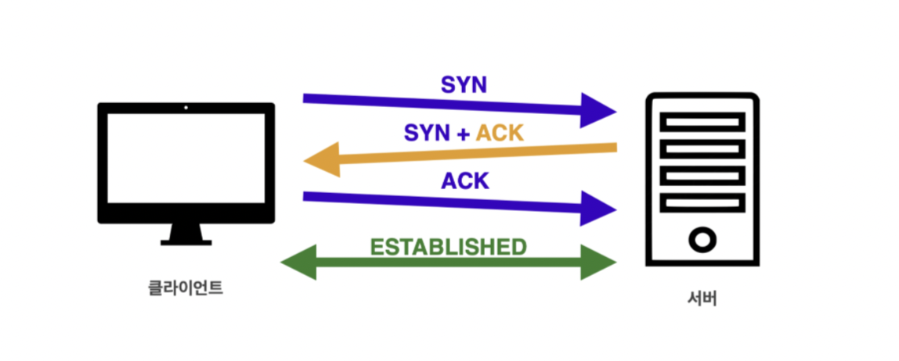

# **[네트워크] 심화**

## IP와 IP Packet

### IP와 IP Packet이란?

클라이언트와 서버는 컴퓨터에 부여된 IP 주소를 이용해 통신할 수 있다. IP는 지정한 IP 주소(IP Address)에 패킷(Packet)이라는 통신 단위로 데이터 전달한다. IP 패킷은 우체국 송장처럼 전송 데이터를 무사히 전송하기 위해 출발지 IP, 목적지 IP와 같은 정보가 포함되어 있다. 패킷 단위로 전송을 하면 노드들은 목적지 IP에 도달하기 위해 서로 데이터를 전달한다. 이를 통해 복잡한 인터넷 망 사이에서도 정확한 목적지로 패킷을 전송할 수 있는 것이다. 서버 역시 IP 패킷을 이용해 클라이언트에 응답을 전달한다.

### IP 프로토콜 한계

- 비연결성
    - 패킷을 받을 대상이 없거나 서비스 불능 상태여도 패킷 전송
- 비신뢰성
    - 중간에 패킷이 사라질 수 있음
    - 패킷의 순서를 보장할 수 없음

## **TCP vs UDP**

P 프로토콜 보다 더 높은 계층에 TCP 프로토콜이 존재하기 때문에 앞서 다룬 IP 프로토콜의 한계를 보완할 수 있다.

1. HTTP 메시지가 생성되면 Socket 라이브러리를 통해 전달(네트워크 소켓: 네트워크 환경에 연결할 수 있게 만들어진 연결부)
2. IP 패킷을 생성하기 전 TCP 세그먼트를 생성
3. TCP/IP 패킷은 LAN 카드와 같은 물리적 계층을 지나기 위해 이더넷 프레임 워크에 포함되어 서버로 전송

### TCP/IP 패킷

TCP 세그먼트에는 IP 패킷의 출발지 IP와 목적지 IP 정보를 보완할 수 있는 출발지 PORT, 목적지 PORT, 전송 제어, 순서, 검증 정보 등을 포함한다.

### TCP 특징

- 연결 지향 - TCP 3 way handshake (가상 연결)
- 데이터 전달 보증
- 순서 보장
- 신뢰할 수는 프로토콜

**TCP 3 way handshake**

1. 클라이언트는 서버에 접속을 요청하는 SYN( Syncronize) 패킷을 보낸다.
2. 서버는 SYN요청을 받고 클라이언트에게 요청을 수락한다는 ACK(Acknowledgment)와 SYN가 설정된 패킷을 발송한다.
3. 클라이언트가 서버에게 ACK을 보내면 이 이후로부터 연결이 성립되며 데이터를 전송할 수 있다.

만약 서버가 꺼져있다면  클라이언트가 SYN을 보내고 서버에서 응답이 없기 떄문에 데이터를 보내지 않는다. 현재에는 최적화가 이루어져 3번 ACK을 보낼때 데이터를 함께 보내기도 한다.

데이터 전송이 성공1적으로 이루어진다면 이에 대한 응답을 돌려주기 때문에 IP 패킷의 한계인 비연결성을 보완할 수 있다. 패킷이 순서대로 도착하지 않는다면 TCP 세그먼트에 있는 정보를 토대로 다시 패킷 전송을 요청할 수 있다. 이를 통해 IP 패킷의 한계인 비신뢰성(순서를 보장하지 않음)을 보완할 수 있다.

### UDP 특징

- 하얀 도화지에 비유 (기능이 거의 없음)
- 비 연결지향 - TCP 3 way handshake X
- 데이터 전달 보증 X
- 순서 보장 X
- 데이터 전달 및 순서가 보장되지 않지만 단순하고 빠름
- 신뢰성 보다는 연속성이 중요한 서비스(e.g. 실시간 스트리밍)에 자주 사용

IP 프로토콜에 PORT, 체크섬 필드 정보만 추가된 단순한 프로토콜

* 체크섬 필드: 중복 검사의 한 형태로, 오류 정정을 통해, 공간(전자 통신)이나 시간(기억 장치) 속에서 송신된 자료의 무결성을 보호하는 단순한 방법

TCP 특징과 비교해보면 신뢰성은 낮지만 3 way handshake 방식을 사용하지 않기 때문에 TCP와 비교해 빠른 속도를 보장한다. HTTP3는 UDP를 사용하며 이미 여러 기능이 구현된 TCP보다는 하얀 도화지처럼 커스터마이징이 가능하다는 장점이 있다.

## HTTP

HTTP/1.1, HTTP/2는 TCP 기반이며 HTTP/3는 UDP 기반 프로토콜이다.

### HTTP 특징

- 클라이언트 서버 구조
    - 클라이언트가 서버에 요청을 보내면 서버는 그에 대한 응답을 보내는 클라이언트 서버 구조
- 무상태 프로토콜
    - 서버가 클라이언트의 상태를 보존하지 않음. 서버 확장성이 높지만 클라이언트가 추가 데이터를 전송해야 한다는 장단점이 존재한다.
    - 갑자기 클라이언트 요청이 증가해도 서버를 대거 투입할 수 있다. 응답 서버를 쉽게 바꿀 수 있는 것이다.
    - 로그인이 필요없는 단순한 서비스 소개 화면같은 경우엔 무상태로 설계할 수 있지만 로그인이 필요한 서비스라면 유저의 상태를 유지해야 되기 때문에 브라우저 쿠키, 서버 세션, 토큰등을 이용해 상태를 유지해야 한다.
- 비연결성
    - TCP/IP의 경우 기본적으로 연결을 유지한다. 이러한 경우 연결을 유지하는 서버의 자원이 계속 소모가 된다. 비 연결성을 가지는 HTTP에서는 실제로 요청을 주고 받을 때만 연결을 유지하고 응답을 주고나면 TCP/IP 연결을 끊는다. 최소한의 자원으로 서버 유지를 가능하게 한다.
    - HTTP 1.0 기준으로, HTTP는 연결을 유지하지 않는 모델이다. 트래픽이 많지 않고, 빠른 응답을 제공할 수 있는 경우, 비연결성의 특징은 효율적으로 작동한다. 하지만 트래픽이 많고, 큰 규모의 서비스를 운영할 때에는 비연결성은 한계를 보인다.
    - 웹 브라우저로 사이트를 요청하면 HTML 뿐만 아니라 자바스크립트, css, 추가 이미지 등 수 많은 자원이 함께 다운로드된다. 해당 자원들을 각각 보낼때마다 연결끊고 다시 연결하고를 반복하는 것은 비효율적이기 때문에 지금은 HTTP 지속 연결(Persistent Connections)로 문제를 해결한다.
    - HTTP 지속 연결에서는 연결이 이루어지고 난 뒤 각각의 자원들을 요청하고 모든 자원에 대한 응답이 돌아온 후에 연결을 종료한다.
- HTTP 메시지
- 단순함, 확장 가능

## HTTP 헤더

HTTP 메시지는 헤더와 바디로 구분할 수 있다. 표현은 요청이나 응답에서 전달할 실제 데이터를 뜻하며 표현 헤더는 표현 데이터를 해석할 수 있는 정보를 제공한다.

### 헤더 형식

`<field-name>:<field-value>` field-name은 대소문자 구분이 없다.

### 헤더 용도

HTTP 전송에 필요한 모든 부가정보를 담기 위해 사용한다. e.g. 메시지 바디의 내용, 메세지 바디의 크기, 압축, 인증, 요청 클라이언트, 서버 정보, 캐시 관리 정보 등. 필요 시 임의의 헤더 추가가 가능하다.

### 표현 헤더

표현 데이터의 형식, 압축 방식, 자연 언어, 길이등을 설명하는 헤더이다. 표현헤더는 요청, 응답 둘 다 사용한다.

- Content-Type: 표현 데이터의 형식
- Content-Encoding: 표현 데이터의 압축 방식
- Content-Language: 표현 데이터의 자연 언어
- Content-Length: 표현 데이터의 길이

### HTTP 주요 헤더

**요청(Request)에서 사용되는 헤더**

From: 유저 에이전트의 이메일 정보

Referer: 이전 웹 페이지 주소

User-Agent: 유저 에이전트 애플리케이션 정보

Host: 요청한 호스트 정보(도메인)

Origin: 서버로 POST 요청을 보낼 때, 요청을 시작한 주소를 나타냄

Authorization: 인증 토큰(e.g. JWT)을 서버로 보낼 때 사용하는 헤더

**응답(Response)에서 사용되는 헤더** 

Server: 요청을 처리하는 ORIGIN 서버의 소프트웨어 정보

Date: 메시지가 발생한 날짜와 시간

Location: 페이지 리디렉션

Allow: 허용 가능한 HTTP 메서드

Retry-After: 유저 에이전트가 다음 요청을 하기까지 기다려야 하는 시간

참고: List of HTTP header fields [https://en.wikipedia.org/wiki/List_of_HTTP_header_fields](https://en.wikipedia.org/wiki/List_of_HTTP_header_fields)

### **콘텐츠 협상 헤더**

협상 헤더는 요청시에만 사용한다.

Accept: 클라이언트가 선호하는 미디어 타입 전달

Accept-Charset: 클라이언트가 선호하는 문자 인코딩

Accept-Encoding: 클라이언트가 선호하는 압축 인코딩

Accept-Language: 클라이언트가 선호하는 자연 언어

reference: [https://developer.mozilla.org/ko/docs/Web/HTTP/Content_negotiation](https://developer.mozilla.org/ko/docs/Web/HTTP/Content_negotiation)

## 웹 캐시

### 캐시의 기본 원리 및 적용

**HTTP 헤더 - 캐시**

캐시(cache)는 컴퓨터 과학에서 데이터나 값을 미리 복사해 놓는 임시 장소이다. 캐시의 접근 시간에 비해 원래 데이터를 접근하는 시간이 오래 걸리는 경우나 값을 다시 계산하는 시간을 절약하고 싶은 경우에 사용한다. 

브라우저에 캐시를 저장할 땐 헤더에 cache-control 속성을 통해 캐시가 유효한 시간을 지정할 수 있다. 캐시의 경우 유효시간이 초과하면 다시 요청을 보내 새로운 데이터로 캐시를 업데이트 해야 한다.

### **캐시 검증 헤더와 조건부 요청**

캐시 유효시간이 지났지만 변경이 없기 때문에 해당 데이터를 써도 되는 상황이라면 이를 검증하고 사용하는 방법이 있다. 

**Last-Modified와 If-Modified-Since**

검증 헤더 Last Modified는 데이터가 마지막으로 수정된 시간정보를 헤더에 포함한다. 응답 결과를 캐시에 저장할 때 데이터 최종 수정일도 저장된다. 캐시 유효시간이 초과되더라도 If-Modified-Since 헤더를 이용해 조건부 요청을 할 수 있다.

서버의 해당 자료의 최종 수정일과 비교해서 데이터가 수정이 안되었을 경우 응답 메세지에 이를 담아서 알려준다. 이때 HTTP Body는 응답 데이터에 없으며 상태코드는 304 Not Modified로 변경된 것이 없다는 뜻이다. 전송 데이터에 바디가 빠졌기 때문에 헤더만 포함된 0.1M만 전송된다. 클라이언트에서는 해당 응답을 받은 뒤 캐시를 갱신해주고 다시 일정시간동안 유효하게 된다.

**ETag와 If-None-Match**

Last-Modified와 If-Modified-Since보다 좀 더 간단한 방식이다. 서버에서 헤더에 ETag를 작성해 응답한다. 클라이언트의 캐시에서 해당 ETag 값을 저장한다. 캐시시간이 초과되서 다시 요청을 해야하는 경우라면 이때 ETag값을 검증하는 If-None-Match를 요청 헤더에 작성해서 보낸다.

단순하게 ETag만 보내서 같으면 유지, 다르면 다시 받는 방식이다. 캐시 제어 로직을 서버에서 완전 관리하고, 클라이언트는 단순히 이 값을 서버에 제공한다.

**Cache-Control**

- Cache-Control: max-age - 캐시 유효 시간. 초 단위
- Cache-Control: no-cache - 데이터는 캐시해도 되지만, 항상 Origin 서버에 검증하고 사용
- Cache-Control: no-store - 데이터에 민감한 정보가 있으므로 저장하면 안됨

**Expires**

- 캐시 만료일을 정확한 날짜로 지정
- HTTP 1.0부터 사용
- 지금은 더 유연한 Cache-Control: max-age 권장
- Cache-Control: max-age와 함께 사용하면 Expires는 무시됨

### 프록시 캐시(Proxy Cache)

프록시란, 클라이언트와 서버 사이에 대리로 통신을 수행하는 것을 가리켜 ‘프록시(Proxy)’, 그 중계 기능을 하는 서버를 프록시 서버라고 한다. 클라이언트, 혹은 반대로는 서버가 다른 네트워크에 간접적으로 접속 할 수 있기 때문에, 보안, 캐싱을 통한 성능, 트래픽 분산 등의 장점을 가진다. 클라이언트에서 사용하고 저장하는 캐시를 private 캐시라 하며 프록시 캐시 서버의 캐시를 public 캐시라 한다.

**Cache-Control(프록시 캐시와 관련)**

- Cache-Control: public - 응답이 public 캐시에 저장되어도 됨
- Cache-Control: private - 응답이 해당 사용자만을 위한 것, private 캐시에 저장해야 함(기본값)
- Cache-Control: s-message - 프록시 캐시에만 적용되는 max-age
- Age: 60 (HTTP 헤더) - 오리진 서버에서 응답 후 프록시 캐시 내에 머문 시간(초)

**캐시 무효화**

클라이언트가 캐시를 적용하지 않아도 임의로 브라우저가 캐시를 적용하는 경우, 특정 페이지에서 캐시가 되면 안되는 정보가 있다면 다음과 같은 지시어로 무효화할 수 있다.

- Cache-Control: no-cache - 데이터는 캐시해도 되지만, 항상 원 서버에 검증하고 사용
- Cache-Control: no-store - 데이터에 민감한 정보가 있으므로 저장하면 안됨
- Cache-Control: must-revalidate - 캐시 만료 후 최초 조회 시 원 서버에 검증해야 함. 원 서버 접근 실패 시 반드시 오류가 발생해야 함. 캐시 유효 시간이라면 캐시를 사용함.
- Pragma: no-cache - HTTP 1.0 하위 호환

캐시를 무효화를 확실하게 해야하는 경우 Pragma와 같은 하위호환까지 포함한 모든 지시어를 적용해야 한다.

## **CDN(Content Delivery Network)**

콘텐츠를 좀더 빠르고 효율적으로 제공하기 위해 등장했다. 세계 곳곳에 분포하는 데이터 센터에 콘텐츠를 저장해 두고 콘텐츠 요청을 받으면 지리적으로 가장 가까운 데이터 센터에서 콘텐츠를 제공해주는 방식이다.

CDN이 다룰수 있는 콘텐츠의 종류는 정적 콘텐츠와 동적 콘텐츠로 구분할 수 있다. 정적 콘텐츠는 동영상, HTML 파일과 같이 변화가 거의 없는 콘텐츠와 더불어 뉴스 기사등 개인화 되지 않은 대중적인 콘텐츠이다. 콘텐츠들은 변화가 거의 없기때문에 CDN의 캐시 센터에 저장하는것이 적합하다.

동적콘텐츠는 위치, IP 주소등 접근할때 마다 내용이 달라지는 콘텐츠이다. 또한 카드번호, 전화번호등 개인화된 정보 관련 콘텐츠가 해당한다. CDN에 저장되어 있는 콘텐츠들은 내용이 바뀔때마다 CDN 서버들에도 변경내용이 전파되어야 하기 때문에 내용이 자주 바뀌는 동적 콘텐츠 자체는 CDN 네트워크가 지원하기 어렵다.

### CDN을 사용하는 이유

1. DDoS 공격에 대응이 가능
2. 사용자 경험의 향상
3. 비용의 절감

### CDN이 서버를 분산하는 방식

Scattered 방식과 Consolidated 방식이 있다.

**Scattered 방식**

1. 세계 곳곳에 최대한 많은 캐시 서버를 제공
2. 낮은 수용량의 데이터 센터 및 캐시 서버
3. 매우 높은 관리 비용 및 사용자 요금
4. 연결 수요가 적은 지역 대상으로 적절한 방식

**Consolidated 방식**

1. 다수의 고성능 서버로 통합하여 운용하는 방식
2. 응답시간 증가, 하지만 관리 및 유지 비용이 낮아짐
3. 연결 수요가 많은 지역 대상으로 적절한 방식

초기에는 응답 속도에 중점을 두었다. 따라서 Scattered 방식, 정적 컨텐츠 CDN이 주류였다. 응답속도는 매우 높았지만 사용자에게 전가되는 비용이 매우 높았다. 하지만 점차 동적 컨텐츠를 지원하고 데이터센터를 통합하기 시작했다. 관리하는 데이터센터의 수가 줄어들기 때문에 사용자에게 전가되는 비용은 줄어들고 있다. 또한 DDoS 공격등 사이버 공격에 대응하고 어느 상황에서도 콘텐츠를 제공할수 있도록 보안과 안정성에 집중하고 있다.

## Sprint Review

- keep-live 헤더를 통해서 HTTP 지속 연결이 가능하다. 요즘에는 비연결성은 특징이라고 보기 어렵다.
- 현재 HTTP/2 점유율 60%, HTTP/3 점유율 20~30%
- **Quick UDP Internet Connection** - HTTP/3는 **`QUIC`** 프로토콜 위에서 돌아가는 HTTP

참고: [https://evan-moon.github.io/2019/10/08/what-is-http3/](https://evan-moon.github.io/2019/10/08/what-is-http3/)

- 프록시 서버를 사용해야 하는 이유

참고: [https://www.cmswire.com/information-management/5-reasons-your-company-should-use-proxy-servers](https://www.cmswire.com/information-management/5-reasons-your-company-should-use-proxy-servers)