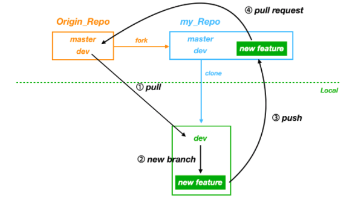

# 프로젝트 준비

### 기획

기획 의도를 통해 상대방의 머릿속에 어떤 그림을 그려내는지가 중요하다. 기획 의도와 다른 상대방의 반응을 보고 "제 의도는 그게 아니었습니다." "제가 말하려던 것은 그게 아니에요"라고 말하면 이미 잘못된 기획이다. **내가 작성한 기획서를 상대방의 입장에서 읽어봐야 한다.** 우리가 전달하고 싶은 **What**을 상대방이 생각할 수 있는 **Why**로 연결시켜야 한다.

아래 두 질문을 명확하게 답변할 수 있어야 한다.

**Q. 왜 이 프로젝트 기획하게 되었나요?**

**Q. 이 프로젝트에는 어떤 기능을 담을 예정인가요?**

### git flow

### **프로젝트 기획 및 범위 설정**

구두로 합의 되었다고 기획이 정해진 것이 아니다. 프로젝트 아이디어에 해당 기능이 왜 필요한 것인지 목적과 함께 기술하는 것이 좋다. 

### **프론트엔드 세부 기획 진행**

**1) 페이지 나누기**

서비스에 어떤 페이지가 존재할지 고민. **서비스에서 보일 모든 페이지를 리스트업**

**2) 와이어프레임 (페이지별 기획)**

완성본이 어떻게 보일지 눈으로 확인하기 위해 직접 서비스를 손으로, 또는 툴로 그려보는 것

**3) 사용자 여정(user journey)와 플로우 차트 (Optional)**

플로우 차트는 기능 또는 목적 단위로 사용자들의 동선에 따라 흐름을 표현하는 문서

### **백엔드 세부 기획 진행**

**1) 스키마 작성**

스키마 작성은 데이터베이스의 구조를 설계하는 작업

**2) API 문서 작성**

API 문서는 **엔드포인트 요청 방식과 응답 결과를 나타낸 문서**

**3) 아키텍처 다이어그램 작성**

한눈에 전체 서비스를 설명한 아키텍처 다이어그램을 구성

### **위키 및 기능 To Do 리스트 작성**

고민한 **기획 전반을 문서로 적는 곳.** 위키 문서는 **여러분이 기획을 마무리하고, 코드 작업을 시작하기 전에 작성.**

- 프로젝트 소개
  - 프로젝트에 대한 전반적인 서비스 설명과 핵심기능
- 팀 룰
- 각 팀 원의 포지션과 Worklog
- 와이어프레임
  - 문서 링크 & 이미지 첨부
- DB 스키마
  - 이미지 첨부
- API 문서
  - 문서 링크
- 기타 (UI Design, Flow Chart 등)

### **태스크 카드 작성 및 분배**

코딩을 진행하기 전, 가장 중요한 단계가 있는데, 바로 **기능별로 태스크 카드를 설정하는 것**

**태스크 카드 설정 Tip**

1. 하나의 기능을 **세분화**해 태스크당 예상 소요 시간을 3시간 이하로 지정해주는 것이 좋다. 기능별로 세세한 태스크를 미리 생성하지 않으면 프로젝트 방향성을 잃어버리기 쉽다.
2. 총 예상 소요 시간은 팀원들과 작성한 태스크 카드의 합과 같아야 한다.

**맡은 태스크를 주어진 시간 내에 끝내지 못했다면 팀장이나 팀원들에게 공유해야 한다.** 

Milestone은 이정표 역할을 하며, 태스크 카드(Issue)들을 그룹화하는데 사용한다.